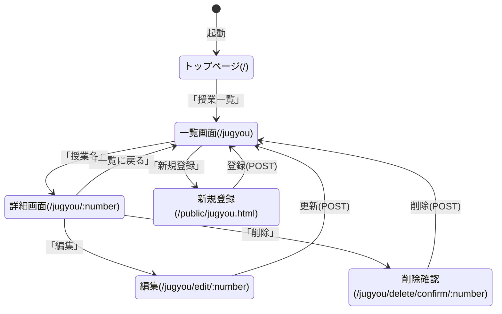

```mermaid
stateDiagram-v2
    direction TB

    state "トップページ(/)" as Top
    state "一覧画面(/jugyou)" as List
    state "詳細画面(/jugyou/:number)" as Detail
    state "新規登録(/public/jugyou.html)" as New
    state "編集(/jugyou/edit/:number)" as Edit
    state "削除確認(/jugyou/delete/confirm/:number)" as DelConf

    [*] --> Top : 起動
    Top --> List : 「授業一覧」

    %% 分岐
    List --> Detail : 「授業名」
    List --> New : 「新規登録」

    New --> List : 登録(POST)

    %% 詳細からの分岐
    Detail --> Edit : 「編集」
    Detail --> DelConf : 「削除」
    Detail --> List : 「一覧に戻る」

    Edit --> List : 更新(POST)
    DelConf --> List : 削除(POST)
```