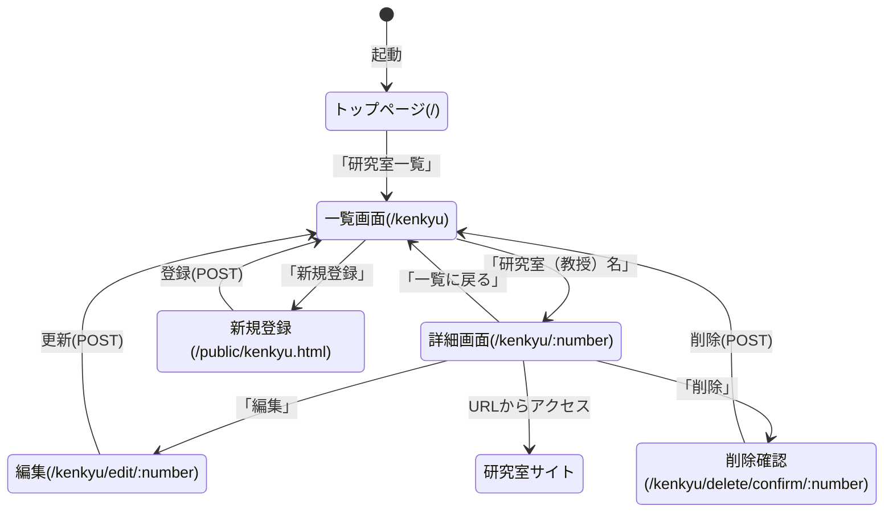

```mermaid
stateDiagram-v2
    direction TB

    state "トップページ(/)" as Top
    state "一覧画面(/kenkyu)" as List
    state "詳細画面(/kenkyu/:number)" as Detail
    state "新規登録(/public/kenkyu.html)" as New
    state "編集(/kenkyu/edit/:number)" as Edit
    state "削除確認(/kenkyu/delete/confirm/:number)" as DelConf
    state "研究室サイト" as gaibu

    [*] --> Top : 起動
    Top --> List : 「研究室一覧」

    %% 分岐
    List --> Detail : 「研究室（教授）名」
    List --> New : 「新規登録」

    New --> List : 登録(POST)

    %% 詳細からの分岐
    Detail --> Edit : 「編集」
    Detail --> DelConf : 「削除」
    Detail --> List : 「一覧に戻る」

    Edit --> List : 更新(POST)
    DelConf --> List : 削除(POST)

    Detail --> gaibu : URLからアクセス
```